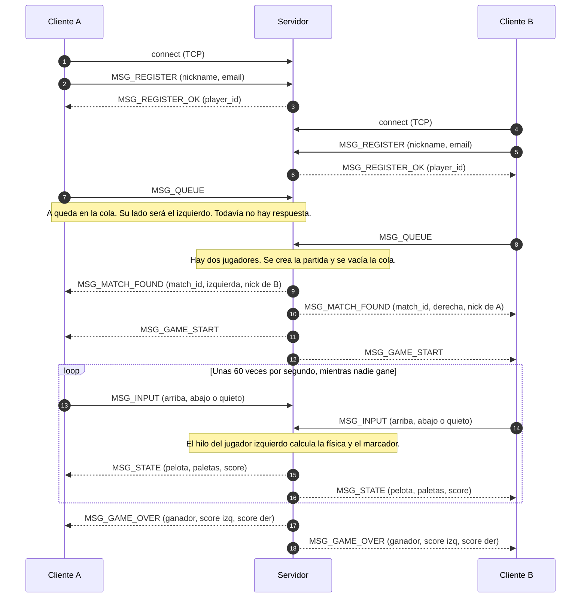
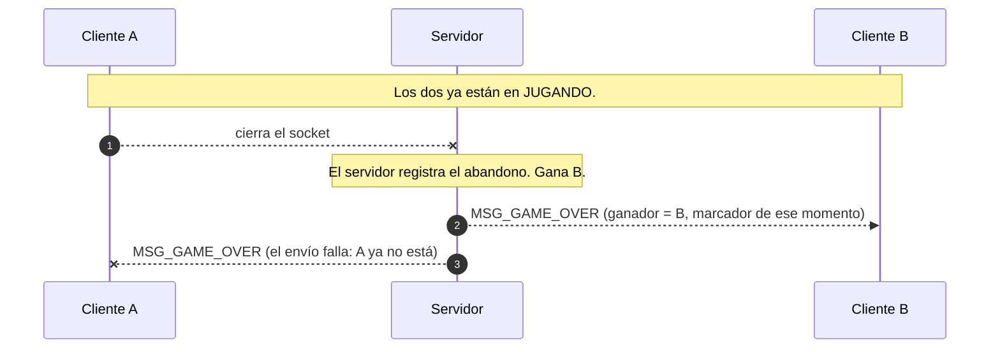

# Diagrama de secuencia — MyAppGameProtocol

**Fase 9 · UML**
**Autor:** Alejandro Correa

Este diagrama muestra el orden de los mensajes de una partida 1 contra 1.
El servidor es el único que habla con los dos clientes: ningún cliente le
escribe al otro. El flujo coincide con `server/src/match.c` y con
`server/src/client_handler.c`.

El primer jugador que manda `MSG_QUEUE` no recibe respuesta todavía. Se queda
en la cola (en la ventana, "Buscando rival...") hasta que entra el segundo.
Recién ahí el servidor manda `MSG_MATCH_FOUND` a los dos.

## Si un jugador se va a mitad

El cierre del socket no es un mensaje del rival. Lo detecta el servidor
(`recv` devuelve 0, o `send` falla). La partida termina y gana quien se quedó.
`MSG_GAME_OVER` se manda a los dos; al que ya cerró, el envío falla y el
proceso sigue.

## Cómo leerlo

Las flechas llenas (`->>`) son mensajes que el cliente envía. Las punteadas
(`-->>`) son las respuestas del servidor. El `loop` es el partido: input y
estado se repiten hasta que alguien llega al puntaje ganador o un jugador se
desconecta.

`MSG_GAME_START` de A y el de B los mandan hilos distintos (cada jugador tiene
el suyo). Cada cliente ve su `MSG_MATCH_FOUND` antes que su `MSG_GAME_START`.
Entre el inicio de A y el de B no hay un orden fijo.

`MSG_STATE` lo arma un solo hilo, el del jugador izquierdo, y se lo manda a
los dos. Así los dos dibujan el mismo marcador. El cliente no calcula la pelota.

## Para sustentar

**¿Qué muestra este diagrama?**
El orden de la conversación: primero el registro, después la cola, después
el aviso de rival, el inicio, el intercambio de teclas y estado, y el cierre.

**¿Por qué el primero que entra a la cola no recibe un mensaje?**
Porque todavía no hay rival. `MSG_MATCH_FOUND` solo sale cuando el segundo
manda `MSG_QUEUE`. Hasta ese momento el cliente solo muestra que está buscando.

**¿Quién calcula el marcador?**
El servidor, en el hilo del jugador izquierdo. Viaja dentro de cada
`MSG_STATE`. Los dos clientes lo dibujan; no lo calculan.

**¿Qué pasa si A cierra el juego a mitad?**
El servidor lo detecta, le da la victoria a B y se lo dice con
`MSG_GAME_OVER`. El proceso no se cae.
